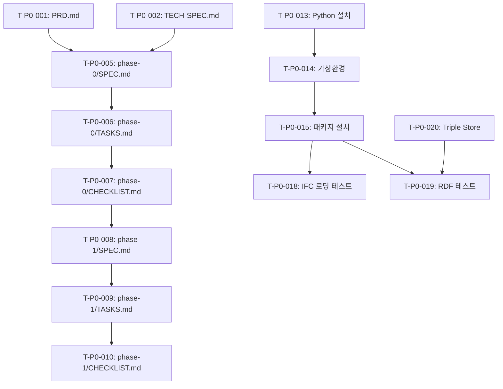

# Phase 0: 프로젝트 초기화 및 문서화 - Tasks

## Metadata

- **Phase**: Phase 0
- **Status**: 🚧 In Progress (40%)
- **Last Updated**: 2026-02-03
- **Target Date**: 2026-02-10

---

## Task Overview

| Category | Total | Completed | In Progress | Pending |
|----------|-------|-----------|-------------|---------|
| 문서화 | 12 | 4 | 8 | 0 |
| 환경 설정 | 5 | 0 | 0 | 5 |
| 검증 | 3 | 0 | 0 | 3 |
| **Total** | **20** | **4** | **8** | **8** |

**Overall Progress**: 40% (8/20 완료 또는 진행 중)

---

## 1. 문서화 작업 (Documentation)

### 1.1 핵심 프로젝트 문서

- [x] **T-P0-001**: PRD.md 작성
  - Priority: P0
  - Effort: 4h
  - Status: ✅ Completed
  - Completion Date: 2026-02-03
  - Notes: 537 라인, 11개 섹션 완료

- [x] **T-P0-002**: TECH-SPEC.md 작성
  - Priority: P0
  - Effort: 4h
  - Status: ✅ Completed
  - Completion Date: 2026-02-03
  - Notes: 아키텍처, 기술 스택, API 설계 포함

- [x] **T-P0-003**: CONTEXT.md 작성
  - Priority: P0
  - Effort: 2h
  - Status: ✅ Completed
  - Completion Date: 2026-02-03
  - Notes: 프로젝트 요약, 빠른 참조 정보 포함

- [x] **T-P0-004**: PROGRESS.md 작성
  - Priority: P0
  - Effort: 2h
  - Status: ✅ Completed
  - Completion Date: 2026-02-03
  - Notes: 8개 마일스톤, KPI 추적 포함

### 1.2 Phase 구조 문서

- [x] **T-P0-005**: phase-0/SPEC.md 작성
  - Priority: P0
  - Effort: 1h
  - Status: ✅ Completed
  - Completion Date: 2026-02-03
  - Notes: Phase 0 목표, 요구사항, 성공 기준

- [x] **T-P0-006**: phase-0/TASKS.md 작성
  - Priority: P0
  - Effort: 1h
  - Status: 🚧 In Progress (이 문서)
  - Completion Date: -
  - Notes: 작업 목록 및 체크리스트

- [ ] **T-P0-007**: phase-0/CHECKLIST.md 작성
  - Priority: P0
  - Effort: 0.5h
  - Status: ❌ Pending
  - Completion Date: -
  - Notes: 완료 기준 체크리스트

- [ ] **T-P0-008**: phase-1/SPEC.md 작성
  - Priority: P0
  - Effort: 1h
  - Status: ❌ Pending
  - Completion Date: -
  - Notes: IFC 파싱 및 RDF 변환

- [ ] **T-P0-009**: phase-1/TASKS.md 작성
  - Priority: P0
  - Effort: 1h
  - Status: ❌ Pending
  - Completion Date: -

- [ ] **T-P0-010**: phase-1/CHECKLIST.md 작성
  - Priority: P0
  - Effort: 0.5h
  - Status: ❌ Pending
  - Completion Date: -

- [ ] **T-P0-011**: phase-2 ~ phase-7 문서 작성
  - Priority: P1
  - Effort: 10h
  - Status: ❌ Pending
  - Completion Date: -
  - Notes: 각 Phase별 SPEC, TASKS, CHECKLIST (6개 Phase x 3개 문서)

### 1.3 설정 파일

- [ ] **T-P0-012**: README.md 업데이트
  - Priority: P1
  - Effort: 1h
  - Status: ❌ Pending
  - Completion Date: -
  - Notes: 프로젝트 개요, 설치 가이드, 사용법 추가

---

## 2. 환경 설정 작업 (Environment Setup)

### 2.1 Python 환경

- [ ] **T-P0-013**: Python 3.8+ 설치 확인
  - Priority: P0
  - Effort: 0.5h
  - Status: ❌ Pending
  - Completion Date: -
  - Command:
    ```bash
    python --version
    # Expected: Python 3.8.x or higher
    ```

- [ ] **T-P0-014**: Python 가상환경 생성
  - Priority: P0
  - Effort: 0.5h
  - Status: ❌ Pending
  - Completion Date: -
  - Command:
    ```bash
    python -m venv venv
    source venv/bin/activate  # Linux/Mac
    # venv\Scripts\activate   # Windows
    ```

- [ ] **T-P0-015**: requirements.txt 작성 및 패키지 설치
  - Priority: P0
  - Effort: 1h
  - Status: ❌ Pending
  - Completion Date: -
  - Dependencies:
    ```
    ifcopenshell>=0.7.0
    rdflib>=6.0.0
    SPARQLWrapper>=2.0.0
    fastapi>=0.100.0
    uvicorn>=0.20.0
    pytest>=7.0.0
    pytest-cov>=4.0.0
    ```
  - Command:
    ```bash
    pip install -r requirements.txt
    ```

### 2.2 Java 환경 (Apache Jena)

- [ ] **T-P0-016**: Java 11+ 설치 확인
  - Priority: P1
  - Effort: 0.5h
  - Status: ❌ Pending
  - Completion Date: -
  - Command:
    ```bash
    java -version
    # Expected: OpenJDK 11 or higher
    ```

- [ ] **T-P0-017**: Apache Jena 설치
  - Priority: P1
  - Effort: 1h
  - Status: ❌ Pending
  - Completion Date: -
  - Notes: Phase 4 (추론 엔진)에서 본격 사용, Phase 0에서는 선택 사항

---

## 3. 기술 스택 검증 (Technology Validation)

### 3.1 IFC 파싱 검증

- [ ] **T-P0-018**: ifcopenshell로 IFC 파일 로딩 테스트
  - Priority: P0
  - Effort: 1h
  - Status: ❌ Pending
  - Completion Date: -
  - Test Script:
    ```python
    # scripts/test_ifc_loading.py
    import ifcopenshell

    # Test 1: Load small IFC file
    ifc_file = ifcopenshell.open('references/nwd4op-12.ifc')
    print(f"Schema: {ifc_file.schema}")
    print(f"Total Entities: {len(ifc_file)}")

    # Test 2: Extract specific entities
    walls = ifc_file.by_type('IfcWall')
    print(f"Total Walls: {len(walls)}")

    columns = ifc_file.by_type('IfcColumn')
    print(f"Total Columns: {len(columns)}")
    ```
  - Success Criteria:
    - nwd4op-12.ifc (224MB) 로딩 성공
    - 엔티티 추출 성공
    - 메모리 사용량 < 4GB

### 3.2 RDF 기본 검증

- [ ] **T-P0-019**: RDFLib로 기본 triple 생성 테스트
  - Priority: P1
  - Effort: 1h
  - Status: ❌ Pending
  - Completion Date: -
  - Test Script:
    ```python
    # scripts/test_rdf_basic.py
    from rdflib import Graph, Namespace, Literal, URIRef
    from rdflib.namespace import RDF, RDFS

    # Create graph
    g = Graph()

    # Define namespace
    ifc = Namespace("http://ifcowl.openbimstandards.org/IFC4_ADD2#")
    ex = Namespace("http://example.org/")

    # Add triples
    wall = ex.Wall001
    g.add((wall, RDF.type, ifc.IfcWall))
    g.add((wall, RDFS.label, Literal("External Wall")))

    # Query
    for s, p, o in g:
        print(f"{s} {p} {o}")

    # Serialize
    print(g.serialize(format='turtle'))
    ```

### 3.3 Triple Store 검증

- [ ] **T-P0-020**: GraphDB/Neo4j 설치 및 연결 테스트
  - Priority: P0
  - Effort: 2h
  - Status: ❌ Pending
  - Completion Date: -
  - Option 1 - GraphDB (Docker):
    ```bash
    docker run -d -p 7200:7200 \
      --name graphdb \
      -v graphdb-data:/opt/graphdb/home \
      ontotext/graphdb:10.0.0-free
    ```
  - Option 2 - Neo4j (Docker):
    ```bash
    docker run -d -p 7474:7474 -p 7687:7687 \
      --name neo4j \
      -e NEO4J_AUTH=neo4j/password \
      neo4j:latest
    ```
  - Test Script:
    ```python
    # scripts/test_triple_store.py
    from SPARQLWrapper import SPARQLWrapper, JSON

    # GraphDB endpoint
    sparql = SPARQLWrapper("http://localhost:7200/repositories/test")

    # Test query
    sparql.setQuery("""
        SELECT ?s ?p ?o
        WHERE { ?s ?p ?o }
        LIMIT 10
    """)
    sparql.setReturnFormat(JSON)
    results = sparql.query().convert()

    print(results)
    ```
  - Success Criteria:
    - GraphDB/Neo4j 컨테이너 실행 성공
    - 웹 UI 접속 가능 (http://localhost:7200 또는 7474)
    - SPARQL 쿼리 실행 성공

---

## 4. 선택적 작업 (Optional)

### 4.1 Docker 설정

- [ ] **T-P0-OPT-001**: docker-compose.yml 작성
  - Priority: P2
  - Effort: 1h
  - Status: ❌ Pending
  - Notes: GraphDB + API 서버 멀티 컨테이너 구성

### 4.2 개발 도구

- [ ] **T-P0-OPT-002**: .gitignore 작성
  - Priority: P2
  - Effort: 0.5h
  - Status: ❌ Pending
  - Patterns:
    ```
    venv/
    __pycache__/
    *.pyc
    .env
    .DS_Store
    *.log
    data/
    ```

- [ ] **T-P0-OPT-003**: IDE 설정 (VSCode/PyCharm)
  - Priority: P2
  - Effort: 0.5h
  - Status: ❌ Pending

---

## Task Dependencies



---

## Daily Task Breakdown

### Day 1 (2026-02-03) ✅
- [x] T-P0-001: PRD.md 작성
- [x] T-P0-002: TECH-SPEC.md 작성
- [x] T-P0-003: CONTEXT.md 작성
- [x] T-P0-004: PROGRESS.md 작성

### Day 2 (2026-02-04) 🚧
- [x] T-P0-005: phase-0/SPEC.md 작성
- [x] T-P0-006: phase-0/TASKS.md 작성 (이 문서)
- [ ] T-P0-007: phase-0/CHECKLIST.md 작성
- [ ] T-P0-008: phase-1/SPEC.md 작성
- [ ] T-P0-009: phase-1/TASKS.md 작성
- [ ] T-P0-010: phase-1/CHECKLIST.md 작성

### Day 3 (2026-02-05)
- [ ] T-P0-011: phase-2 ~ phase-7 문서 작성 (6개 Phase)
- [ ] T-P0-012: README.md 업데이트

### Day 4 (2026-02-06)
- [ ] T-P0-013: Python 설치 확인
- [ ] T-P0-014: 가상환경 생성
- [ ] T-P0-015: requirements.txt 작성 및 설치

### Day 5 (2026-02-07)
- [ ] T-P0-018: IFC 파일 로딩 테스트
- [ ] T-P0-019: RDF 기본 테스트

### Day 6-7 (2026-02-08~09)
- [ ] T-P0-020: Triple Store 설치 및 테스트
- [ ] T-P0-016: Java 설치 확인 (선택)
- [ ] T-P0-017: Apache Jena 설치 (선택)

### Day 8 (2026-02-10)
- [ ] Phase 0 검토 및 완료 확인
- [ ] Phase 1 준비

---

## Effort Summary

| Category | Tasks | Estimated Hours | Actual Hours |
|----------|-------|-----------------|--------------|
| 문서화 | 12 | 18h | 12h (진행 중) |
| 환경 설정 | 5 | 4h | - |
| 검증 | 3 | 4h | - |
| 선택적 작업 | 3 | 2h | - |
| **Total** | **23** | **28h** | **12h** |

**Progress**: 43% (12h / 28h)

---

## Notes

- 문서화 작업은 dev-docs-writer agent가 자동으로 수행
- 환경 설정 작업은 개발자가 수동으로 수행 필요
- IFC 샘플 파일 경로 확인 필요: `/home/coffin/dev/bim-ontology/references/`
- Triple Store는 GraphDB 권장 (SPARQL 1.1 완전 지원)

---

**Document Version**: v1.0
**Last Updated**: 2026-02-03
**Status**: 🚧 In Progress (40%)
